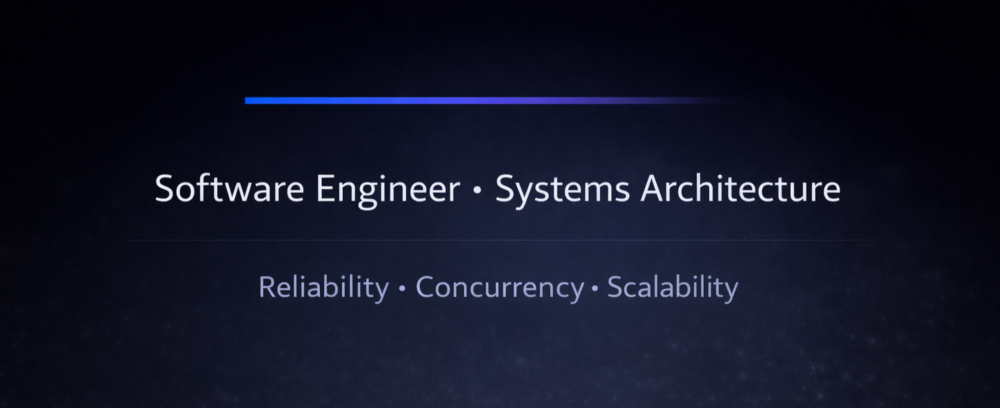

  

<h1 align="center">Hi, I'm Jatin Awankar 👋</h1>
<h3 align="center">Software Engineer focused on scalable web systems</h3>

---

### 🧠 About Me

I design and build production-grade web applications from scratch,  
with a strong focus on:

- System design & architecture
- Performance & scalability
- Understanding internals (not just using abstractions)
- Real-world engineering tradeoffs

I enjoy reading documentation deeply, breaking down how things work,
and building systems that scale beyond just CRUD.

Currently exploring:
- React internals
- Backend architecture
- Distributed systems fundamentals
- Concurrency & networking concepts

---

### 🚀 What I'm Building

- Usage-based SaaS systems
- Scalable backend APIs
- Real-time web applications
- Startup-ready production systems

Interested in early-stage startups and product-focused engineering teams.

---

### 🛠 Tech Stack

**Frontend**
- React
- Next.js
- TypeScript
- Tailwind CSS

**Backend**
- Node.js
- Express
- PostgreSQL
- MongoDB
- Supabase

**Engineering Tools**
- Git
- System Design fundamentals
- REST APIs
- Authentication (OAuth, JWT)
- Performance optimization

---

### 📫 Connect With Me

- LinkedIn: https://linkedin.com/in/jatin-awankar
- GitHub: https://github.com/jatin-awankar
- Email: jatinawankar02@gmail.com
- X: https://x.com/awankar_jay

---

  

